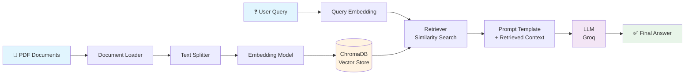
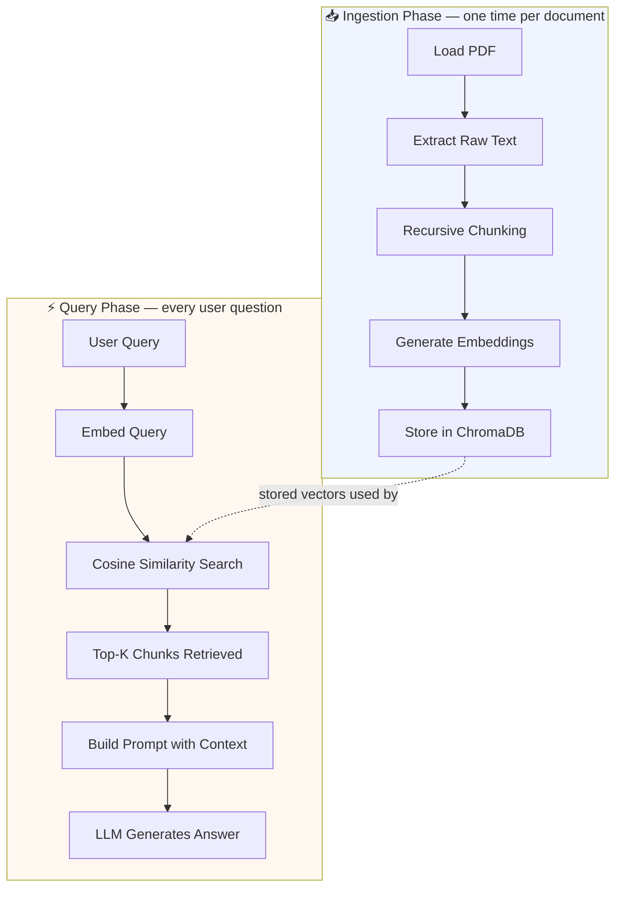
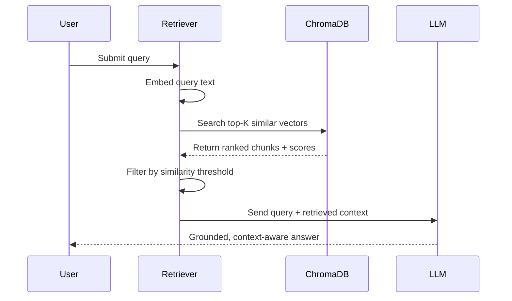

<div align="center">

# 📚 RAG-Pipeline From Scratch

### Retrieval-Augmented Generation System for Intelligent Document Question Answering

*Upload documents. Ask questions. Get grounded, context-aware answers.*

[](https://www.python.org/)
[](https://www.langchain.com/)
[](https://www.trychroma.com/)
[](https://huggingface.co/)
[](#-license)
[](https://github.com/haseeb-ml-engineer/rag-pipeline-from-scratch)

**Repository:** [github.com/haseeb-ml-engineer/rag-pipeline-from-scratch](https://github.com/haseeb-ml-engineer/rag-pipeline-from-scratch)

</div>

---

## 📖 Project Overview

**RAG-Pipeline From Scratch** is a complete, from-first-principles implementation of a **Retrieval-Augmented Generation (RAG)** pipeline for document question answering.

Instead of prompting a language model directly and hoping it "knows" the answer, this system grounds every response in retrieved evidence from your own documents. Users upload PDF files, the system parses and splits them into semantic chunks, generates vector embeddings for each chunk, stores them in a persistent vector database, retrieves the most relevant chunks for a given query, and passes that retrieved context to an LLM to generate an accurate, source-backed answer.

This project was built for **educational purposes** — to understand *how* every stage of a RAG pipeline works internally, not just how to call a high-level `.from_documents()` method — while following patterns and conventions used in production-oriented RAG systems.

> 💡 **Why this matters:** Large language models are powerful but static — they only know what they were trained on, and they hallucinate when asked about information outside that training data. RAG solves this by retrieving relevant, up-to-date, verifiable context at query time and *showing* it to the model before it answers.

> 🚧 **Status:** This project is under active development. Core document loading and chunking components are in progress; the modular pipeline (embeddings, vector store, retriever, generation) is being built incrementally. Usage instructions will be added once the pipeline is complete.

---

## ✨ Key Features

- 📄 **PDF Ingestion** — Load and parse single or multiple PDF documents
- ✂️ **Semantic Chunking** — Recursive character-based text splitting that preserves context
- 🧬 **Vector Embeddings** — Dense semantic representations via Sentence Transformers / HuggingFace models
- 🗄️ **Persistent Vector Store** — ChromaDB-backed storage for fast similarity search across sessions
- 🔍 **Similarity-Based Retrieval** — Cosine similarity search with configurable Top-K retrieval
- 🧠 **Context-Aware Generation** — Groq-hosted LLM generates answers grounded in retrieved chunks
- 🏗️ **Modular Architecture** — Cleanly separated loader, splitter, embedder, retriever, and generation components
- 📝 **Prompt Construction** — Structured prompt templates that inject retrieved context before generation

---

## 🏛️ System Architecture

| Component | Responsibility |
|---|---|
| **Document Loader** | Reads raw PDF files and extracts text content page by page (`PyPDFLoader`) |
| **Text Splitter** | Breaks long documents into overlapping, semantically coherent chunks (`RecursiveCharacterTextSplitter`) |
| **Embedding Model** | Converts each text chunk into a dense numerical vector that captures meaning (Sentence Transformers / HuggingFace) |
| **Vector Store** | Persists embeddings and enables fast similarity search over them (ChromaDB) |
| **Retriever** | Given a query, retrieves the Top-K most semantically similar chunks |
| **Prompt Template** | Assembles the user's question and retrieved context into a structured prompt |
| **LLM** | Generates a natural-language answer grounded in the retrieved context (Groq) |
| **Output Parser** | Formats the final model output into a clean, presentable answer |

---

## 🔄 RAG Workflow

The pipeline follows a strict sequence — each stage feeds the next, and a weakness at any stage propagates forward:

1. **PDF Loading** — Raw PDF files are ingested from disk
2. **Document Parsing** — Text is extracted and normalized from each page
3. **Text Chunking** — Documents are recursively split into smaller, overlapping chunks
4. **Embedding Generation** — Each chunk is converted into a high-dimensional vector
5. **Vector Database Creation** — Embeddings are stored in ChromaDB with metadata
6. **Similarity Search** — A user query is embedded and compared against stored vectors
7. **Retriever** — The Top-K most relevant chunks are selected based on similarity score
8. **Prompt Construction** — Retrieved chunks are injected into a structured prompt template
9. **LLM Response Generation** — The Groq-hosted LLM generates an answer using the provided context
10. **Final Answer** — A grounded, context-aware response is returned to the user

### 🗺️ Overall RAG Pipeline



### 📊 Data Flow



### 🔍 Retrieval Workflow



---

## 🛠️ Technologies Used

| Category | Technology |
|---|---|
| Language | Python |
| Orchestration | LangChain |
| Vector Database | ChromaDB |
| Embeddings | Sentence Transformers / HuggingFace Embeddings |
| LLM Inference | Groq |
| Document Loading | PyPDFLoader |
| Text Splitting | RecursiveCharacterTextSplitter |
| Core Concepts | Vector Embeddings, Semantic Search, Retrieval-Augmented Generation (RAG) |

---

## 📁 Repository Structure

```
RAG_TU.../
│
├── data/
│   ├── pdf/                      # Source PDF documents
│   ├── text_files/                # Extracted / preprocessed text
│   └── vector_store/              # Persisted ChromaDB vector store
│
├── notebook/
│   ├── document.ipynb              # Document loading & parsing experiments
│   └── pdf_loader.ipynb            # PDF loader development notebook
│
├── .venv/                         # Virtual environment (not tracked)
├── .env                           # Environment variables (API keys, config)
├── .gitignore
├── .python-version
├── main.py                        # Entry point
├── pyproject.toml                 # Project metadata & dependencies
├── requirement.txt
├── uv.lock                        # Dependency lockfile (uv)
└── README.md
```

---

## ⚙️ Installation

### Requirements

- Python 3.10 or higher
- pip
- A Groq API key ([console.groq.com](https://console.groq.com))

### Setup

```bash
# 1. Clone the repository
git clone https://github.com/haseeb-ml-engineer/rag-pipeline-from-scratch.git
cd rag-pipeline-from-scratch

# 2. Create and activate a virtual environment
python -m venv venv

# On Windows
venv\Scripts\activate

# On macOS/Linux
source venv/bin/activate

# 3. Install dependencies
pip install -r requirements.txt

# 4. Configure environment variables
cp .env.example .env
# Add your GROQ_API_KEY inside .env
```

### Running the Project

```bash
python main.py
```

---

## 🎓 Learning Outcomes

Building this project from the ground up reinforced several core RAG concepts:

**Why chunking is necessary**
LLMs and embedding models have limited context windows, and embedding an entire document as one vector loses fine-grained meaning. Splitting text into smaller, overlapping chunks preserves local context while keeping each unit small enough to embed and retrieve precisely.

**Why embeddings are needed**
Keyword search only matches exact words or substrings — it has no concept of meaning. Embeddings convert text into dense vectors positioned in a space where semantically similar content sits close together, even when the wording is completely different.

**Why vector databases are used**
Computing similarity between a query and thousands of chunks in real time requires efficient indexing and search — something a plain list or dictionary cannot do at scale. Vector databases like ChromaDB are purpose-built for fast, persistent similarity search.

**How semantic similarity works**
Once text is represented as vectors, similarity between two pieces of text can be measured mathematically — most commonly with **cosine similarity**, which measures the angle between two vectors rather than their magnitude, making it robust to differences in text length.

**Why RAG reduces hallucinations**
Instead of relying purely on what the LLM memorized during training, RAG supplies verified, retrieved context at query time. The model is grounded in actual source material rather than generating an answer purely from parametric memory.

**Advantages over directly prompting an LLM**
- Answers are grounded in your own documents, not just the model's training data
- Reduces hallucination by supplying verifiable context
- No need to fine-tune the model when your data changes — just update the vector store
- Enables source attribution, so answers can be traced back to specific document chunks

---

## 🔮 Future Improvements

- [ ] Web-based interface (potential candidates: Streamlit or FastAPI + frontend)
- [ ] Support for additional document formats (DOCX, TXT, HTML)
- [ ] Hybrid search combining keyword and semantic retrieval
- [ ] Re-ranking retrieved chunks with a cross-encoder
- [ ] Conversation memory for multi-turn question answering
- [ ] Evaluation suite for retrieval and answer quality metrics
- [ ] Dockerized deployment

---

## 🙏 Acknowledgements

- [LangChain](https://www.langchain.com/) for orchestration utilities
- [ChromaDB](https://www.trychroma.com/) for vector storage and similarity search
- [Hugging Face](https://huggingface.co/) and Sentence Transformers for embedding models
- [Groq](https://groq.com/) for fast LLM inference

---

## 📄 License

This project is licensed under the **MIT License** — see the [LICENSE](LICENSE) file for details.

---

## 🤝 Contributing

Contributions, issues, and feature requests are welcome at [rag-pipeline-from-scratch](https://github.com/haseeb-ml-engineer/rag-pipeline-from-scratch).

1. Fork the repository
2. Create a feature branch (`git checkout -b feature/your-feature`)
3. Commit your changes (`git commit -m 'Add your feature'`)
4. Push to the branch (`git push origin feature/your-feature`)
5. Open a Pull Request

---

<div align="center">

**Built to understand RAG from the ground up — not just to use it.**

</div>
